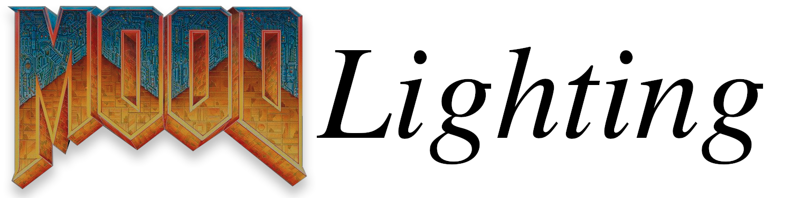
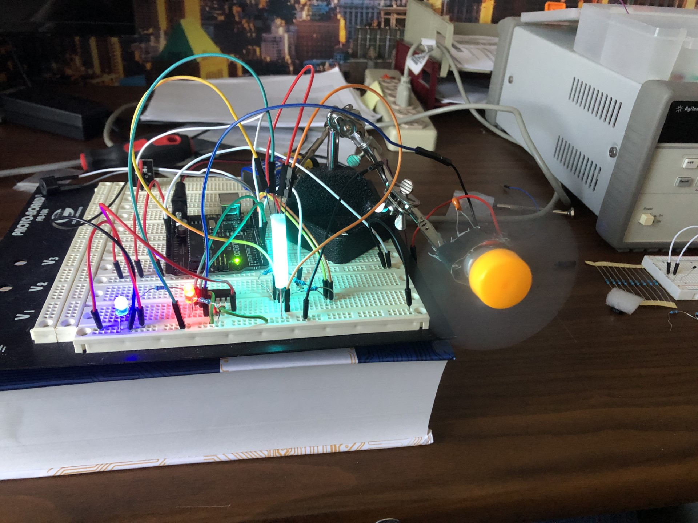
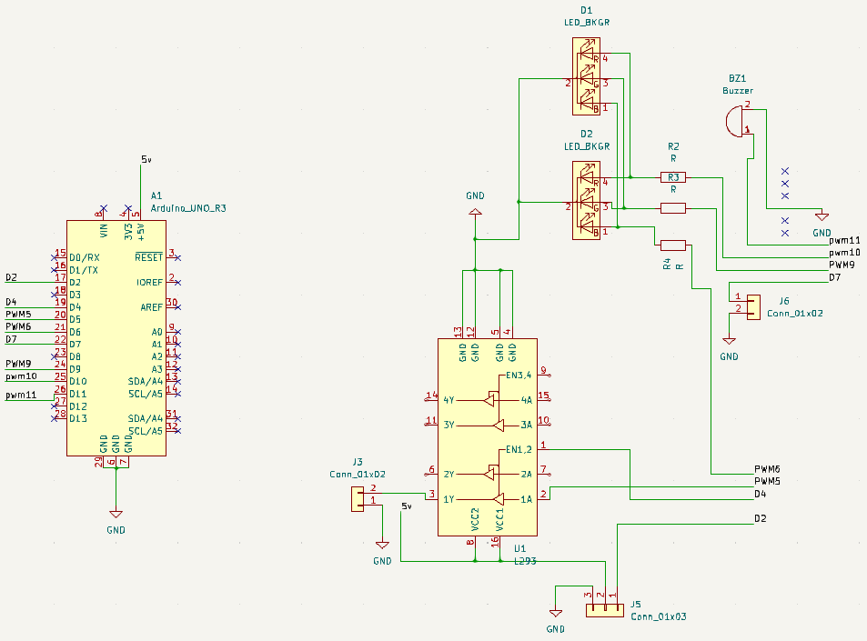

## Table of contents

* [Rationale](README.md#rationale)
* [Safety](README.md#safety)
* [Bill of materials (BOM)](README.md#bill-of-materials)
* [The circuit](README.md#the-circuit)
* [KiCAD](README.md#kicad)
* [Design](README.md#design)
* [Arduino Software](README.md#arduino-software)

---

## Rationale

**Welcome to you're doom!**

Ahem, I mean welcome to the PCB design portion of your summer camp!

This project was selected to introduce a variety of topics including:

* Circuit schematics / basic electronics
* PCB design (Computer-Aided Design using KiCAD)
* Hardware / Software trojans
* Hardware / Software bugs

By the end of these two weeks you will have a basic understanding of how to 
layout and build a basic circuit and what vulnerabilities it may have 
unintentional or otherwise).

---

## Safety

A (brief) word on safety.  All of the equipment and materials used in this project
are safe, so long as they are used properly.

Our goal is to make sure that over the two weeks of this project you are instructed 
on how to perform each of the steps needed to manufacture a PCB safely.  **Please do
NOT turn on any of the machines or use any of the equipment until you have had the 
safety overview for that equipment or process.** 

Similarly, if you are unsure on the safe way to perform some process just ask one of 
our several lab assitants.  We are happy to help!  There will be additional safety
instructions covered over the course of the two weeks and all relevant safety documents
will be kept in the `Safety` folder in this repository.

---

## Bill of materials

Most of the materials have already been inlcuded in your Elegoo kit.  These include:

* Arduino project board
* Various items from the elegoo kit
  * 2x Tri-color LED
  * 3x 330Ω Resistors
  * Buzzer
  * L293D
  * DC Motor
  * IR Receiver and Remote Control
  * 2μF Capacitor

Other items needed include:

* Copper clad PCB board
* Solder
* PCB Fabrication Equipment

---

## The Circuit

The circuit started as this:

and ended up as this:

---

## KiCAD

We will be using the open source Computer-Aided Drawing / Electronics Design Automation (CAD/EDA) suite [KiCad](https://www.kicad.org/).  This software can be installed freely on Windows/Mac/Linuxand is very powerful.  Further documentation and cheatsheets can be found in the `KiCad` folder of this repository.

---

## Design

The project aims to design a remote-controlled color-changing light system with RGB LEDs controlled by three PWM signals. The system will be operated using an IR remote controller, allowing users to adjust LED colors and brightness levels to create various vibrant RGB combinations. Notably, as a part of the project's educational goals, an intentional inclusion of "malicious" code will be introduced. This demonstration will emphasize the importance of secure coding practices, as the code will play the E1M1 DOOM song when a specific button sequence is entered. The project's primary focus is on exploring LED control technology, color customization, and the implications of unsecured coding practices. Safety measures will not be implemented, as the project's central objective is to highlight the potential risks associated with inadequate security measures. The project seeks to provide users with an informative and insightful experience while demonstrating the significance of security in electronic systems.

---

## Ardunio Software 

[The code can be found here.](https://github.com/wrightedu/mood/tree/main/updated_mood/updated_mood_code)

